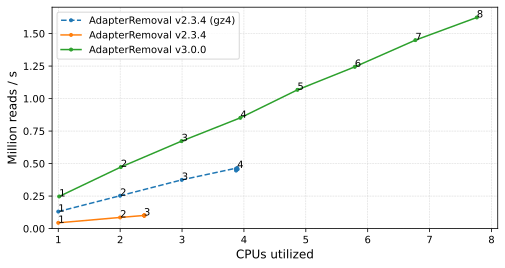

# AdapterRemoval v3 - Dang fast(Q) processing

[](https://github.com/MikkelSchubert/adapterremoval/actions/workflows/test.yaml) [](https://adapterremoval.readthedocs.io/)

AdapterRemoval trims adapter sequences and low quality bases from High-Throughput Sequencing (HTS) data in FASTQ format, merges overlapping paired-end reads into (longer) consensus sequences, demultiplexes FASTQ reads containing 5' barcodes, and more.

AdapterRemoval v3 is a major revision of AdapterRemoval v2 that aims to simplify usage via sensible default settings. AdapterRemoval v3 expands the range of features available in v2 (see below), as well as greatly increasing throughput.

- [Highlights](#highlights)
- [Getting started](#getting-started)
- [Documentation](#documentation)
- [Support](#support)
- [Citation](#citation)

## Highlights

Features introduced in AdapterRemoval v3 are marked with a "**(v3)**":

- Supports Linux, MacOS, and Windows **(v3)**
- Trimming of adapter sequences from single-end and paired-end FASTQ reads
  - Trimming of multiple, different adapters or adapter pairs
- Detailed [human-readable](https://mikkelschubert.github.io/adapterremoval/examples/3.x.html) and [machine-readable](https://mikkelschubert.github.io/adapterremoval/examples/3.x.json) QC reports **(v3)**
  - The ability to perform QC-only runs with or without read processing **(v3)**
- Barcode-based demultiplexing with or without trimming of adapter sequences
  - Support for samples identified by multiple barcode pairs **(v3)**
  - Support for mixed orientation barcodes **(v3)**
- Support for multiple methods for trimming low quality bases/reads
  - Quality trimming using windows or constant thresholds
  - Quality trimming using the modified Mott algorithm **(v3)**
  - Poly-X tail trimming, supporting any combination of trailing bases **(v3)**
    - Enabled automatically for data generated using two-color sequencing technologies (e.g. Illumina iSeq, NovaSeq)
- Filtering of reads based on complexity **(v3)**
- Reconstruction of adapter sequences by pair-wise alignment of paired-end reads
- Merging of overlapping read-pairs into higher-quality consensus sequences
- Support for reading interleaved FASTQ files
- Support for flexible routing of output to files or STDOUT **(v3)**
- Support for writing FASTQ, SAM, and BAM files **(v3)**
- Support for SSE2, AVX2, AVX512, and NEON accelerated alignments **(v3)**

### Performance

AdapterRemoval v3 features greatly increased throughput compared to AdapterRemoval v2. This is accomplished through support for additional SIMD instruction sets, and improved parallelization of I/O and computationally expensive tasks. To enable this, compression of output is now block-based, defaults to a lower compression level (4), and uses a more efficient implementation (libdeflate).

Please note that these results are preliminary:



Point labels indicate the number of threads configured on the command line. The X-axis shows actual CPU utilization. The Y-axis shows millions of 150bp reads processed per second in paired-end mode, with gzipped input and output.

Benchmarking was performed on an Intel i9-11900K with 8 physical cores, and plotting is therefore limited to ~8 CPUs. AdapterRemoval v2 was observed not to scale past 4 threads. AdapterRemoval v2 was run with default settings and `--gzip-level 4` (gz4).

## Getting started

### Installation

Precompiled binaries are provided for [Linux, MacOS, and Windows](https://github.com/MikkelSchubert/adapterremoval/releases).

**NOTE**: The precompiled Linux binary sacrifices performance for compatibility. To achieve the best performance, it is therefore recommended to install packages provided by your Linux distribution, if these are available, or to build AdapterRemoval from source. See the [documentation](#documentation) for more information.

### Basic usage

To run AdapterRemoval, specify the location of mate 1 and, optionally, mate 2 FASTQ files using the `--in-file1` and `--in-file2` command-line options. When the `--out-prefix` option is used, AdapterRemoval will create a set of standard output files starting with that prefix:

```
adapterremoval3 --in-file1 reads_1.fastq.gz --in-file2 reads_2.fastq.gz --out-prefix my_results
```

This command will automatically detect and trim adapter sequences and low-quality bases from the input, filter short reads, write non-filtered reads to gzip-compressed FASTQ files, and generate HTML and JSON reports.

Many more examples of common usage may be found in the [Examples](https://adapterremoval.readthedocs.io/en/latest/examples.html) section of the online documentation.

## Documentation

For a detailed description of program installation and usage, please refer to the [online documentation](https://adapterremoval.readthedocs.io/). A summary of command-line options may also be found in the [manual page](https://adapterremoval.readthedocs.io/en/latest/manpage.html), accessible via the command `man adapterremoval3` once AdapterRemoval has been installed.

## Support

For questions, bug reports, and/or suggestions, please use the [GitHub tracker](https://github.com/MikkelSchubert/adapterremoval/issues/).

## Citation

AdapterRemoval v3 has not yet been published.

If you use AdapterRemoval v3, please cite AdapterRemoval v2:

```
Schubert, Lindgreen, and Orlando. AdapterRemoval v2: rapid adapter trimming, identification, and read merging. BMC Research Notes 9, 88 (2016). <https://doi.org/10.1186/s13104-016-1900-2>
```

AdapterRemoval was originally published by Lindgreen (2012):

```
Lindgreen. AdapterRemoval: Easy Cleaning of Next Generation Sequencing Reads, BMC Research Notes 5, 337 (2012). <http://www.biomedcentral.com/1756-0500/5/337/>
```
